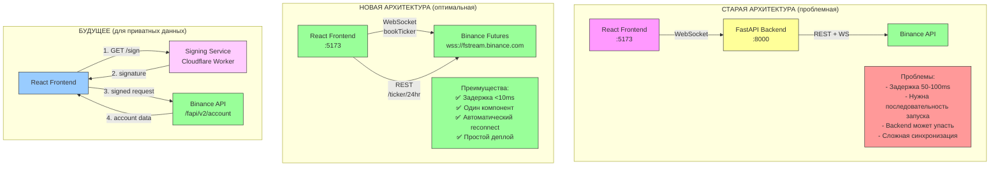

## Сравнение метрик

| Метрика | Старая архитектура | Новая архитектура | Улучшение |
|---------|-------------------|-------------------|-----------|
| **Задержка (latency)** | 50-100ms | <10ms | **5-10x быстрее** |
| **Компоненты для запуска** | 2 (frontend + backend) | 1 (frontend) | **-50%** |
| **Точки отказа** | 3 (frontend, backend, Binance) | 2 (frontend, Binance) | **-33%** |
| **Проблемы подключения** | Часто (порядок запуска) | Никогда | **✅ Решено** |
| **Деплой** | Docker/VPS для backend | Статический хостинг | **Проще** |
| **Стоимость инфры** | VPS ~$5-20/мес | Vercel Free tier | **-100%** |

## Код WebSocket подключения

### Старая схема (через backend)
```typescript
// Frontend
useWebSocket({ url: 'ws://localhost:8000/ws' })
// ↓
// Backend (FastAPI)
async def websocket_endpoint(websocket: WebSocket):
    await websocket.accept()
    # Proxy Binance → WebSocket
    async for msg in binance_stream:
        await websocket.send_json(msg)
```

**Проблема:** если backend не запущен → frontend висит в ожидании

### Новая схема (прямое подключение)
```typescript
// Frontend
useBinanceDirect({ 
  symbols: ['BTCUSDT', 'ETHUSDT'],
  tickerRefreshMs: 5000
})

// Внутри хука:
const ws = new WebSocket(
  'wss://fstream.binance.com/stream?streams=btcusdt@bookTicker/ethusdt@bookTicker'
)

ws.onmessage = (event) => {
  const { data } = JSON.parse(event.data)
  updatePrice(data.s, (parseFloat(data.b) + parseFloat(data.a)) / 2)
}
```

**Результат:** frontend подключается напрямую, нет зависимости от backend

## Что доступно сейчас

### ✅ Публичные данные (работает)
- Live цены (bid/ask) для всех символов
- Ticker 24h (изменение %, объём, high/low)
- Автоматический reconnect
- Задержка <10ms

### ⏳ Приватные данные (требует signing service)
- Account balance
- Open positions (unrealized PnL)
- Recent trades (realized PnL)
- Equity chart (исторические данные)

## Решение для приватных данных

### Cloudflare Worker (рекомендуется)
```typescript
// worker.ts
import { hmac } from '@noble/hashes/hmac'
import { sha256 } from '@noble/hashes/sha256'

export default {
  async fetch(request: Request, env: Env) {
    const { endpoint, params } = await request.json()
    
    const query = new URLSearchParams(params).toString()
    const signature = hmac(sha256, env.BINANCE_SECRET, query)
    
    return Response.json({
      signature: Buffer.from(signature).toString('hex'),
      ...params
    })
  }
}
```

**Деплой:**
```bash
npx wrangler deploy
# → https://binance-signer.your-name.workers.dev
```

**Использование во frontend:**
```typescript
async function getAccount() {
  const params = { timestamp: Date.now() }
  const { signature } = await fetch('https://binance-signer.your-name.workers.dev/sign', {
    method: 'POST',
    body: JSON.stringify({ endpoint: '/fapi/v2/account', params })
  }).then(r => r.json())
  
  const response = await fetch(
    `https://fapi.binance.com/fapi/v2/account?${new URLSearchParams({...params, signature})}`
  )
  
  return response.json()
}
```
